# MovieFlux — App Navigation Flow

This diagram shows the user navigation flow through the app, matching the routes
declared in `app/src/main/java/com/example/movieflux/navigation/`:

- `AuthGraph` → `Login`
- `MainGraph` → bottom-tab scaffold with `Home`, `Favorites`, `Profile`
- `Details` (`details/{movieId}`) — pushed from Home or Favorites, hides bottom bar

It also shows the loading shimmer, error states, the theme picker on Profile,
the view-mode toggle on Favorites, the biometric gate on app start (with its
failure state), and the share action on Details.

## How to fill the image slots

1. Take screenshots of the running app for each screen below.
2. Save them in `docs/screenshots/` using **exactly** these filenames
   (the Mermaid diagram references them by path):

   | Slot                  | File                                     | What to capture |
   |-----------------------|------------------------------------------|-----------------|
   | Login                 | `docs/screenshots/login.png`             | Login form, idle |
   | Login (error)         | `docs/screenshots/login_error.png`       | Wrong credentials / network error message |
   | Biometric gate        | `docs/screenshots/biometric_gate.png`    | System biometric prompt on app start |
   | Biometric gate (error)| `docs/screenshots/biometric_gate_error.png` | Failed-scan screen with Retry / Use password |
   | Home (loading)        | `docs/screenshots/home_loading.png`      | First-launch shimmer / skeleton cards |
   | Home                  | `docs/screenshots/home.png`              | Popular movies loaded |
   | Home (error)          | `docs/screenshots/home_error.png`        | Network error with retry |
   | Favorites             | `docs/screenshots/favorites.png`         | Favorites tab populated (grid mode) |
   | Favorites (list mode) | `docs/screenshots/favorites_list.png`    | Favorites after switching to list view |
   | Profile               | `docs/screenshots/profile.png`           | Profile root with theme row |
   | Profile (theme)       | `docs/screenshots/profile_theme.png`     | Theme selector open (System/Light/Dark) |
   | Details               | `docs/screenshots/details.png`           | Movie details loaded |
   | Details (error)       | `docs/screenshots/details_error.png`     | Network error on details fetch |
   | Details (share)       | `docs/screenshots/details_share.png`     | System share sheet over the details screen |

3. Recommended size: portrait, ~300×600 px (the diagram caps each image at 110×220).
   Larger images still work — Mermaid scales them down.
4. Commit the PNGs, push, and GitHub renders the diagram inline.

## Diagram (Mermaid v11 `img:` shapes)

```mermaid
flowchart TD
    %% --- App start / biometric gate ---
    BiometricGate@{ img: "screenshots/biometric_gate.png", label: "Biometric gate (app start)", pos: "b", w: 110, h: 220, constraint: "on" }
    BiometricGateError@{ img: "screenshots/biometric_gate_error.png", label: "Biometric gate — failed", pos: "b", w: 110, h: 220, constraint: "on" }

    %% --- Auth ---
    Login@{ img: "screenshots/login.png", label: "Login", pos: "b", w: 110, h: 220, constraint: "on" }
    LoginError@{ img: "screenshots/login_error.png", label: "Login — error", pos: "b", w: 110, h: 220, constraint: "on" }

    %% --- Home states ---
    HomeLoading@{ img: "screenshots/home_loading.png", label: "Home — shimmer (first load)", pos: "b", w: 110, h: 220, constraint: "on" }
    Home@{ img: "screenshots/home.png", label: "Home", pos: "b", w: 110, h: 220, constraint: "on" }
    HomeError@{ img: "screenshots/home_error.png", label: "Home — error", pos: "b", w: 110, h: 220, constraint: "on" }

    %% --- Favorites ---
    Favorites@{ img: "screenshots/favorites.png", label: "Favorites — grid", pos: "b", w: 110, h: 220, constraint: "on" }
    FavoritesList@{ img: "screenshots/favorites_list.png", label: "Favorites — list mode", pos: "b", w: 110, h: 220, constraint: "on" }

    %% --- Profile ---
    Profile@{ img: "screenshots/profile.png", label: "Profile", pos: "b", w: 110, h: 220, constraint: "on" }
    ProfileTheme@{ img: "screenshots/profile_theme.png", label: "Theme picker", pos: "b", w: 110, h: 220, constraint: "on" }

    %% --- Details ---
    Details@{ img: "screenshots/details.png", label: "Details", pos: "b", w: 110, h: 220, constraint: "on" }
    DetailsError@{ img: "screenshots/details_error.png", label: "Details — error", pos: "b", w: 110, h: 220, constraint: "on" }
    DetailsShare@{ img: "screenshots/details_share.png", label: "Details — share sheet", pos: "b", w: 110, h: 220, constraint: "on" }

    %% --- App start ---
    BiometricGate -- "scan ok" --> Home
    BiometricGate -- "scan failed" --> BiometricGateError
    BiometricGateError -- "retry" --> BiometricGate
    BiometricGateError -- "use password" --> Login

    %% --- Auth flow ---
    Login -- "invalid credentials" --> LoginError
    LoginError -- "retry" --> Login
    Login -- "login success" --> HomeLoading

    %% --- Home flow ---
    HomeLoading -- "movies loaded" --> Home
    HomeLoading -- "fetch failed" --> HomeError
    HomeError -- "retry" --> HomeLoading

    %% --- Bottom tabs ---
    Home <-- "bottom tab" --> Favorites
    Home <-- "bottom tab" --> Profile
    Favorites <-- "bottom tab" --> Profile

    %% --- Favorites view mode ---
    Favorites -- "toggle view mode" --> FavoritesList
    FavoritesList -- "toggle view mode" --> Favorites

    %% --- Profile actions ---
    Profile -- "tap Theme row" --> ProfileTheme
    ProfileTheme -- "pick System/Light/Dark" --> Profile
    Profile -- "logout" --> Login

    %% --- Details flow ---
    Home -- "tap movie" --> Details
    Favorites -- "tap movie" --> Details
    FavoritesList -- "tap movie" --> Details
    Details -- "fetch failed" --> DetailsError
    DetailsError -- "retry" --> Details
    Details -- "tap share" --> DetailsShare
    DetailsShare -- "dismiss" --> Details
    Details -- "back" --> Home

    %% --- Styling ---
    classDef errorNode stroke:#d33,stroke-width:2px;
    classDef loadingNode stroke:#888,stroke-dasharray: 4 3;
    classDef dialogNode stroke:#2a7,stroke-width:2px,stroke-dasharray: 2 2;
    class LoginError,HomeError,DetailsError,BiometricGateError errorNode;
    class HomeLoading loadingNode;
    class BiometricGate,DetailsShare dialogNode;
```

> **Note on the `img:` shape:** this syntax was added in Mermaid v11.3.0.
> GitHub upgraded its bundled Mermaid in 2024, so it renders on github.com.
> If you ever see raw `@{ img: ... }` text instead of images, the renderer is
> on an older version — use the fallback grid below instead.

## Fallback: plain markdown grid (works everywhere)

If the Mermaid image shapes don't render in your viewer, this grid does the
same job using standard markdown.

### App start

| | | |
|:---:|:---:|:---:|
| 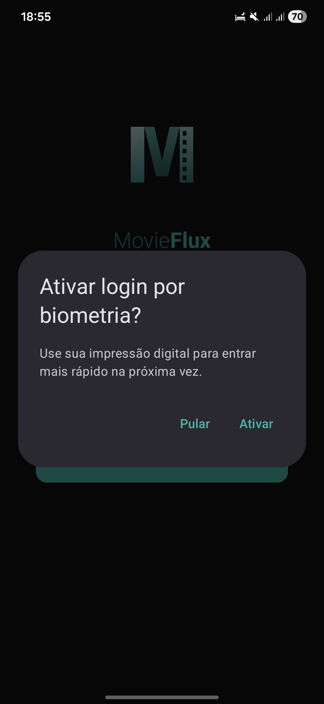 | → scan ok → | 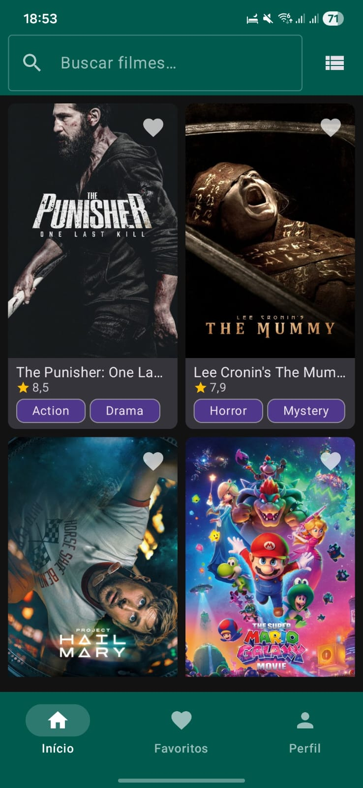 |
| **Biometric gate** | | **Home** |
|  | → scan failed → | 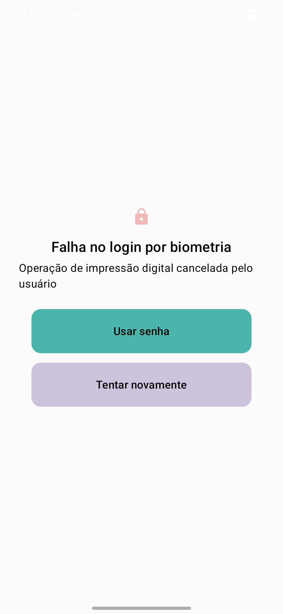 |
| **Biometric gate** | *retry / use password →* | **Gate — failed** |

### Auth

| | | |
|:---:|:---:|:---:|
| 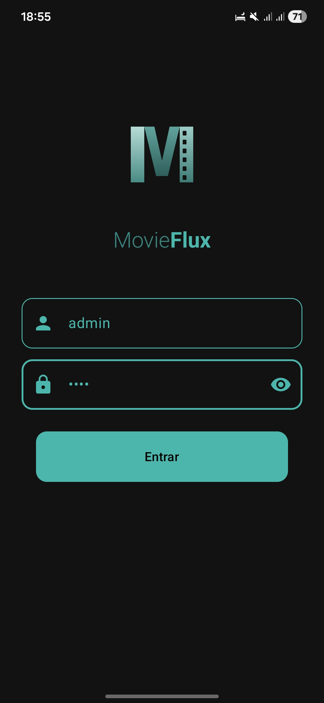 | → invalid → | 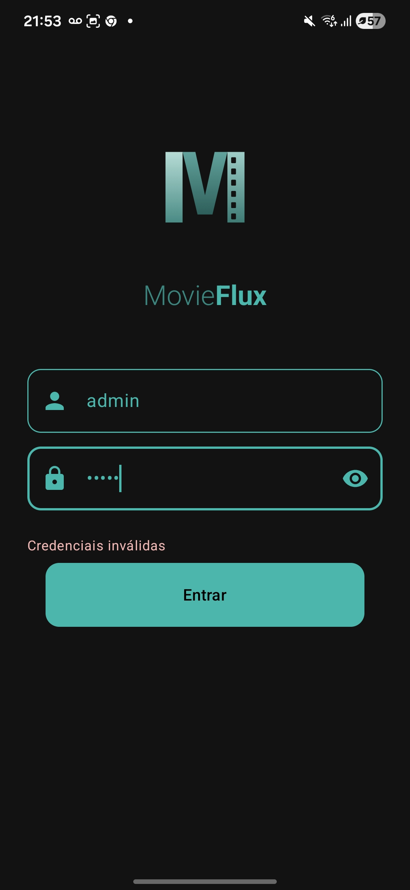 |
| **Login** | | **Login — error** (retry) |
|  | → success → | 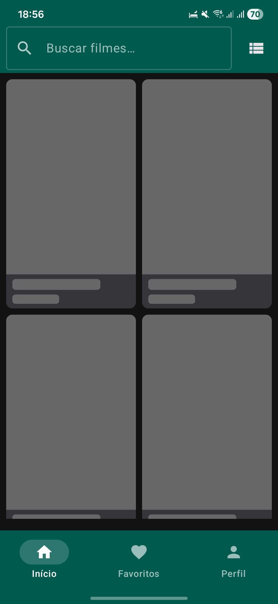 |
| **Login** | | **Home — shimmer** |

### Home states

| | | |
|:---:|:---:|:---:|
|  | → loaded → |  |
| **Shimmer (first load)** | | **Home** |
|  | → fetch failed → | 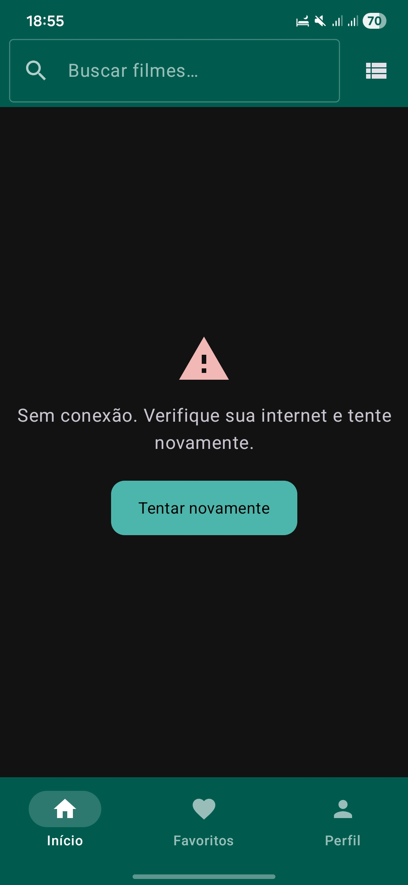 |
| **Shimmer** | | **Error** (retry) |

### Bottom tabs

| | | | | |
|:---:|:---:|:---:|:---:|:---:|
|  | ↔ | 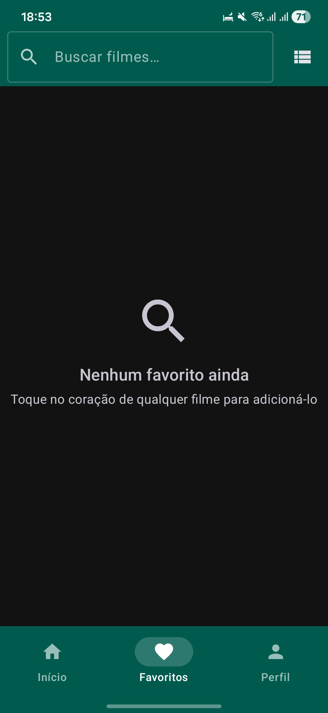 | ↔ | 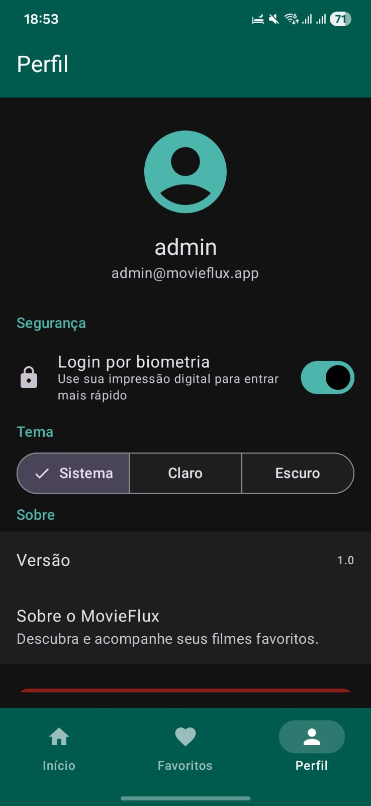 |
| **Home** | *bottom tabs* | **Favorites** | *bottom tabs* | **Profile** |

### Favorites view mode

| | | |
|:---:|:---:|:---:|
|  | ↔ toggle ↔ | 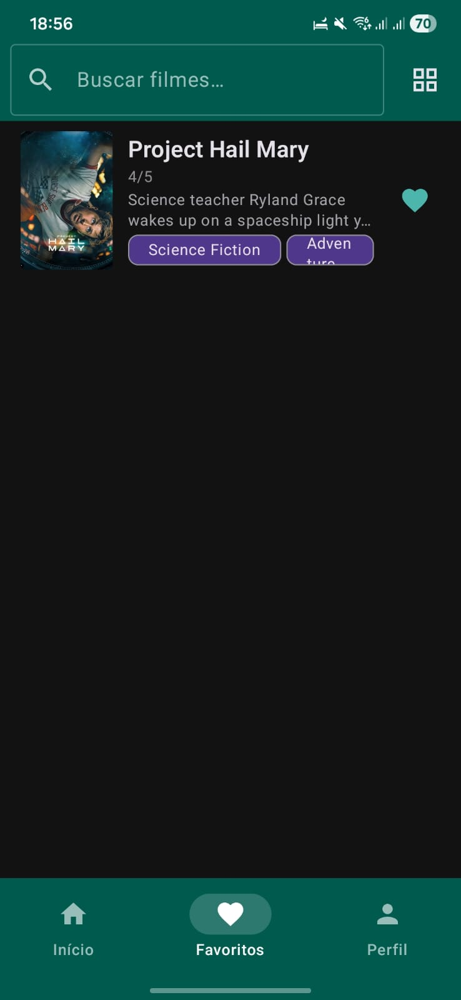 |
| **Favorites — grid** | | **Favorites — list** |

### Profile actions

| | | |
|:---:|:---:|:---:|
|  | → tap Theme → | 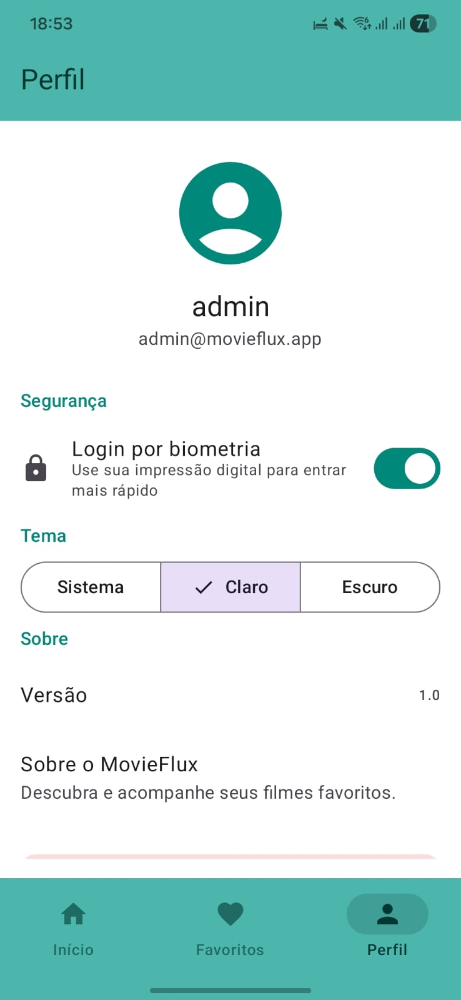 |
|  | → logout → |  |

### Details

| | | |
|:---:|:---:|:---:|
|  | → tap movie → | 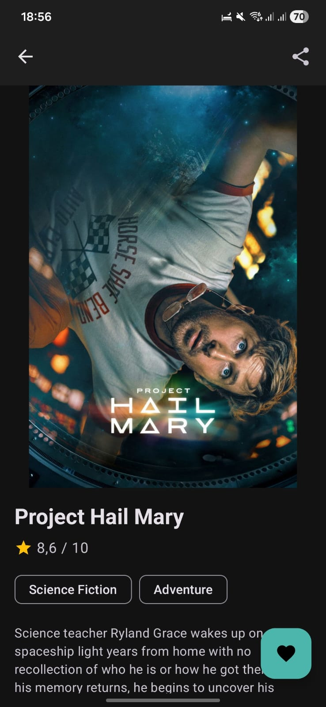 |
|  | → tap share → | 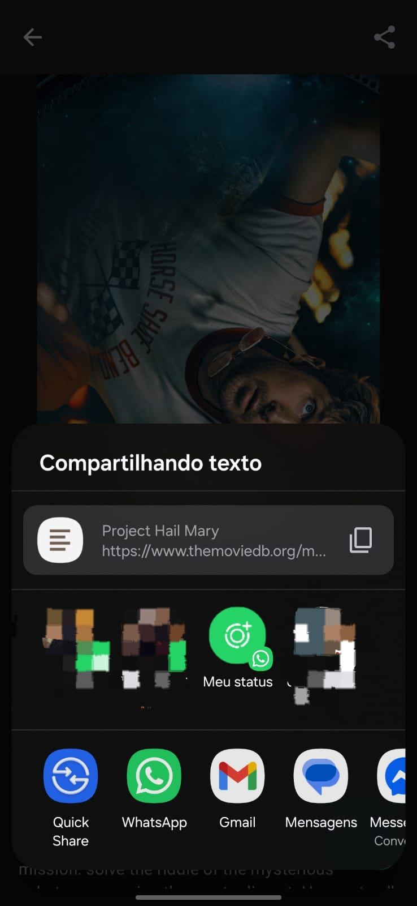 |
|  | → fetch failed → |  |
