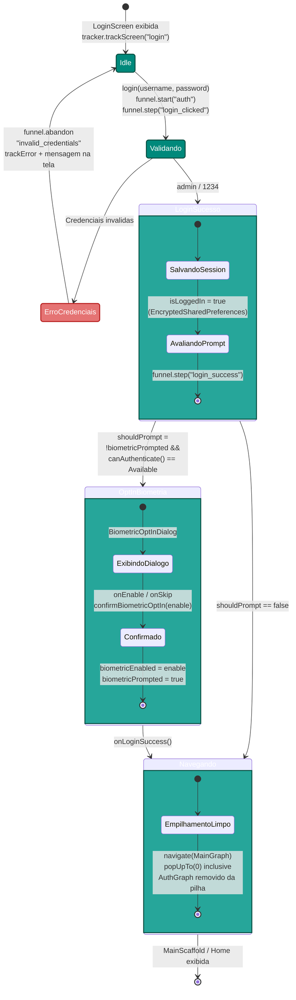
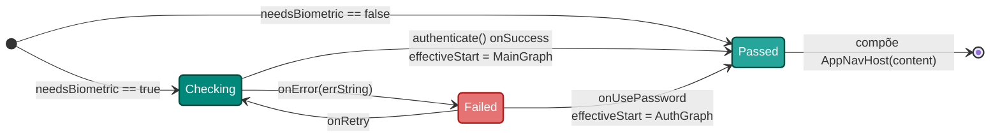
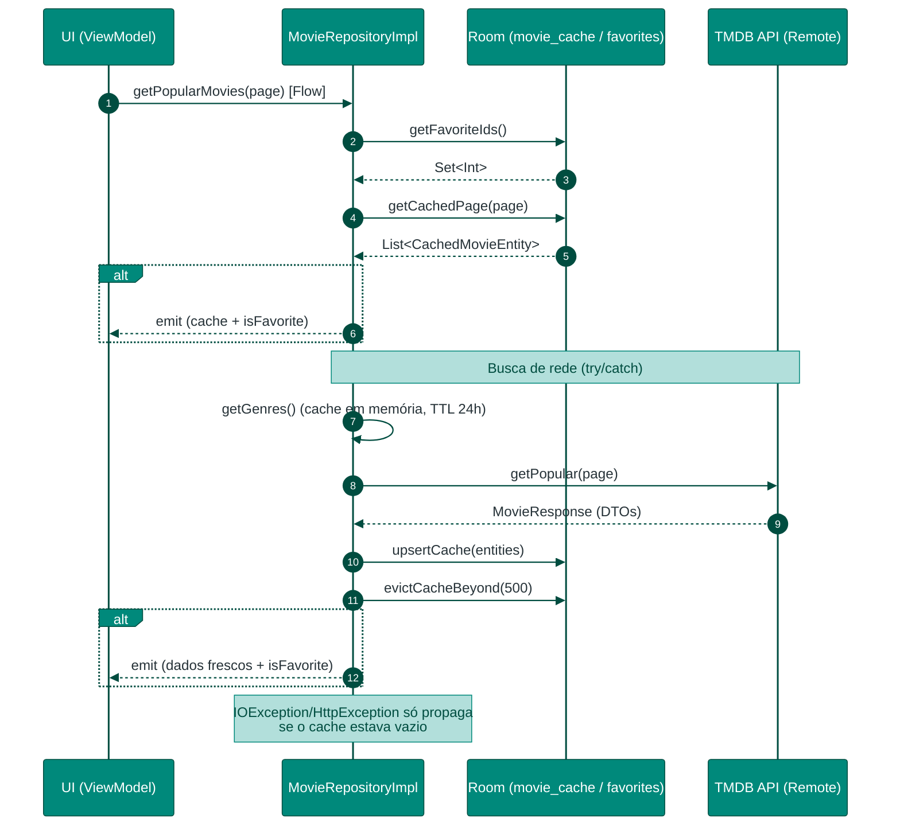
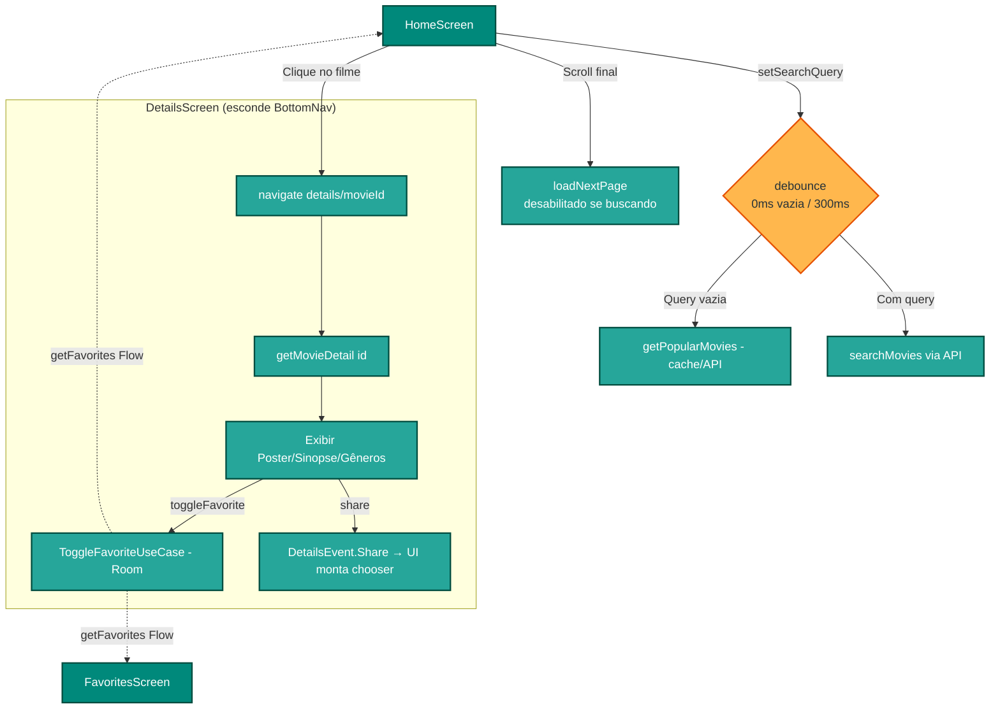
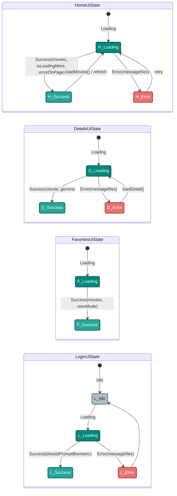
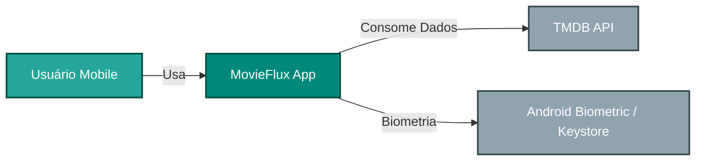
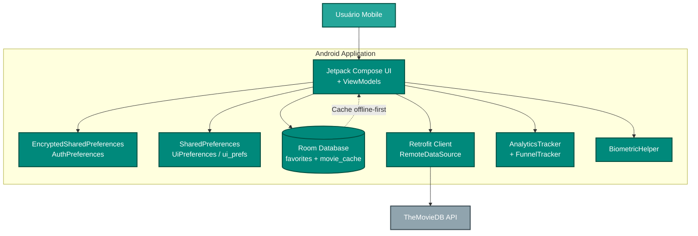
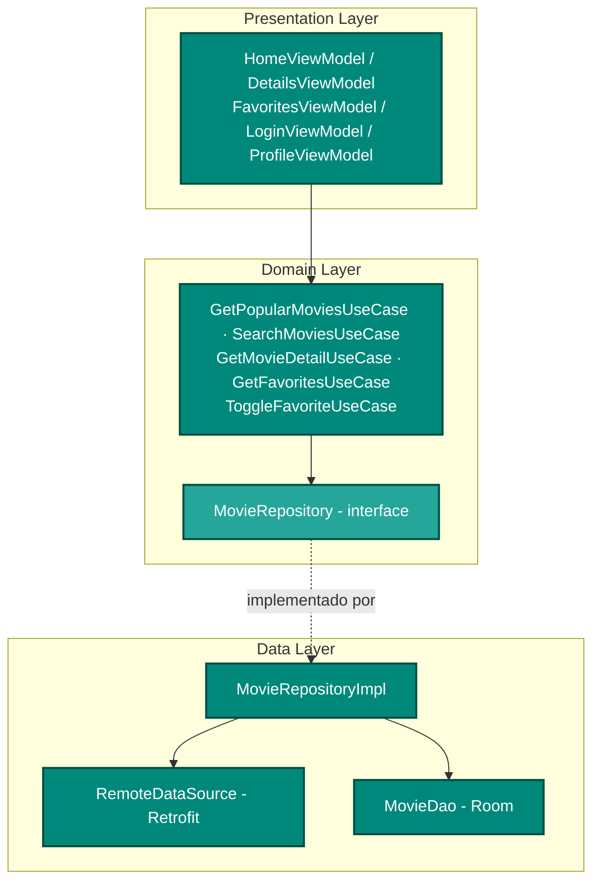
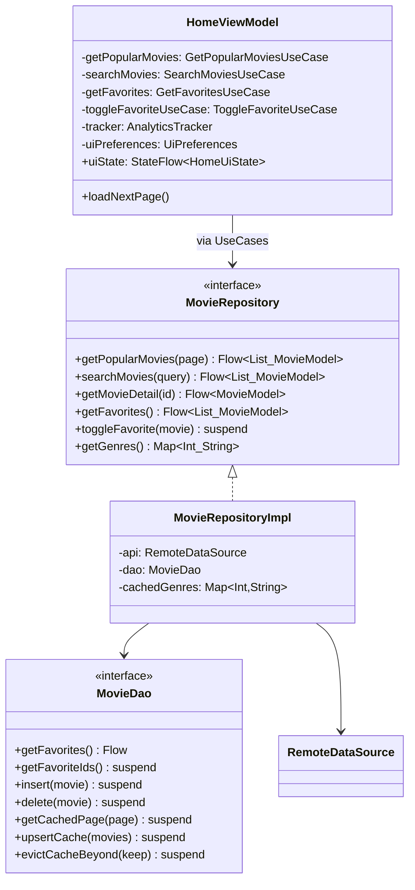

# MovieFlux Diagramas

## 1. Fluxo de Autenticação, Biometria e Navegação

Fluxo real de login (mock `admin / 1234`), com a **opção de habilitar biometria** após o login e o
**gate biométrico no relançamento** do app. Sessão e preferências são persistidas em
`AuthPreferences`, que usa **EncryptedSharedPreferences**.

### 1.1. Gate Biométrico no Relançamento (MainActivity)

A biometria **não** desbloqueia durante o login — ela atua como um gate na reabertura do app.
Só quando `isLoggedIn && biometricEnabled && canAuthenticate() == Available` o `BiometricGate`
exige a digital antes de compor o `NavHost` em `MainGraph`.

---

## 2. Estratégia Offline-First e Sincronização de Dados

Como `MovieRepositoryImpl.getPopularMovies()` combina o cache local (Room, tabela `movie_cache`) e a
API remota. A ordem reflete o código: os IDs de favoritos são lidos **primeiro**, o cache é emitido
imediatamente, e os dados frescos só são re-emitidos **se o conteúdo da página mudou**.

---

## 3. Fluxo de Interação: Home e Detalhes

Navegação entre listagem e detalhes, com busca (debounce: 0ms se vazia, 300ms com texto), paginação
(desabilitada durante busca) e favoritar. As telas ficam dentro do `MainScaffold` com `BottomNavBar`
(Home, Favoritos, Perfil); Detalhes esconde a barra inferior.

---

## 4. Gerenciamento de Estados da UI

Cada ViewModel expõe sua própria `sealed class UiState` via `StateFlow`. **Não existe** um estado
`Empty` genérico — uma busca sem resultados é um `Success` com lista vazia. As telas diferem: Login
tem `Idle`, Favoritos **não tem** `Error`.

---

## 5. C4 Model

Esta seção utiliza o modelo C4 para decompor a arquitetura do MovieFlux em diferentes níveis de abstração.

### Nível 1: Contexto (Context)
Descreve como o MovieFlux interage com usuários e sistemas externos.

### Nível 2: Containers
Componentes técnicos principais dentro do app Android. O armazenamento é dividido entre
**EncryptedSharedPreferences** (auth), **SharedPreferences** (`ui_prefs`: tema e view mode) e **Room**.

### Nível 3: Componentes (Components)
Decompõe a aplicação nas camadas Clean Architecture. Os ViewModels dependem dos UseCases, que
delegam ao `MovieRepositoryImpl`, único ponto que combina remoto e local.

### Nível 4: Código (Code)
Diagrama de classes com as relações principais, alinhado às assinaturas reais.

