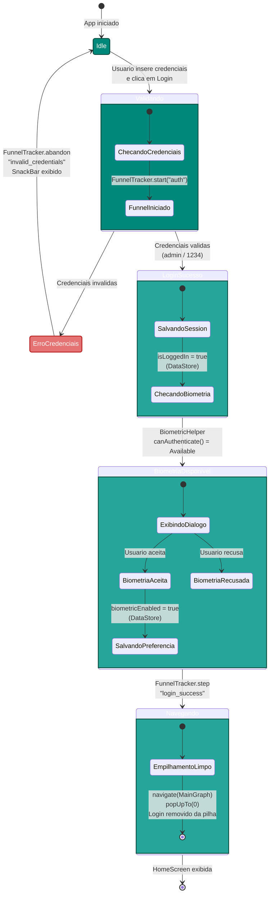
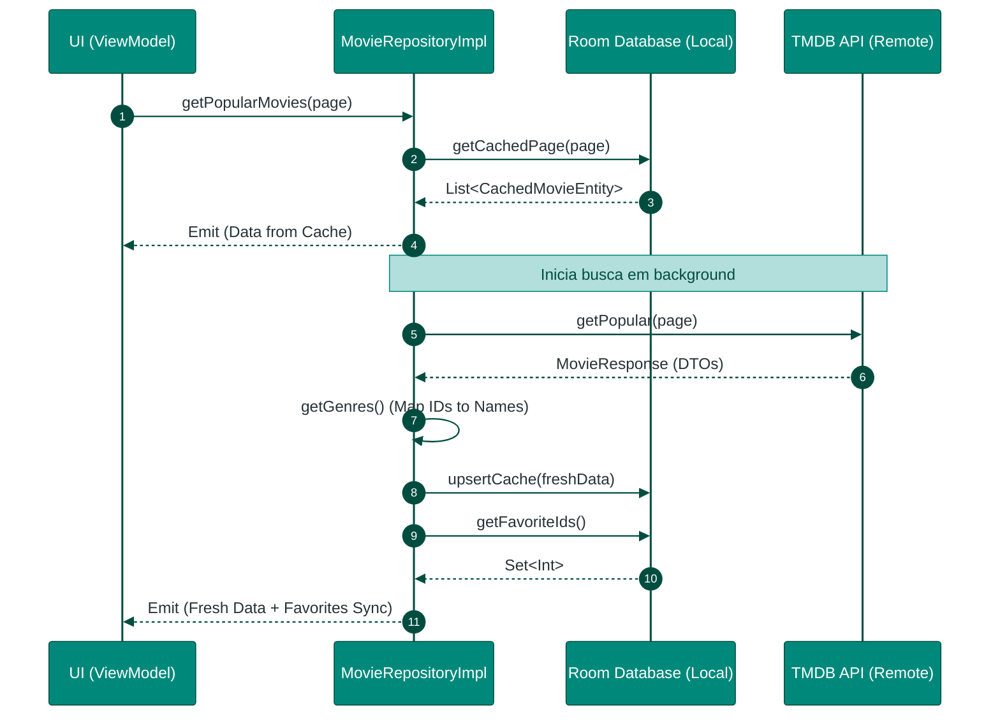
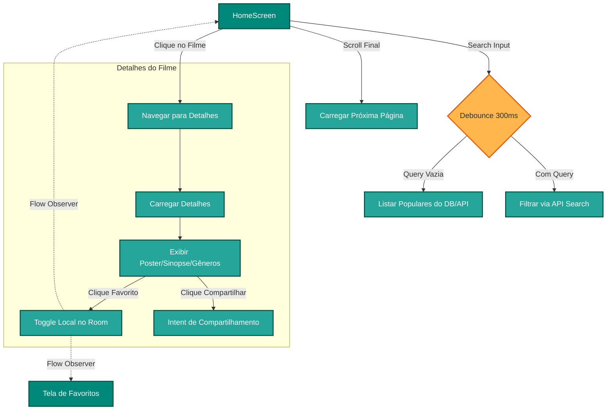
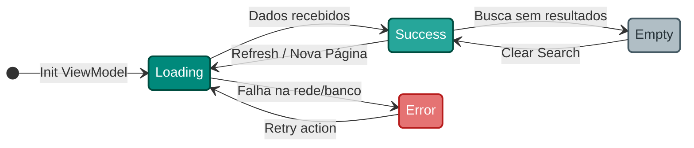
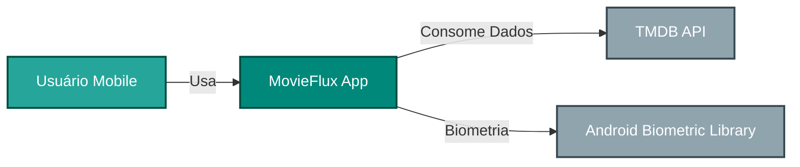
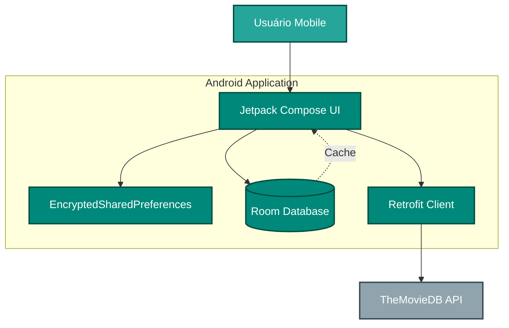
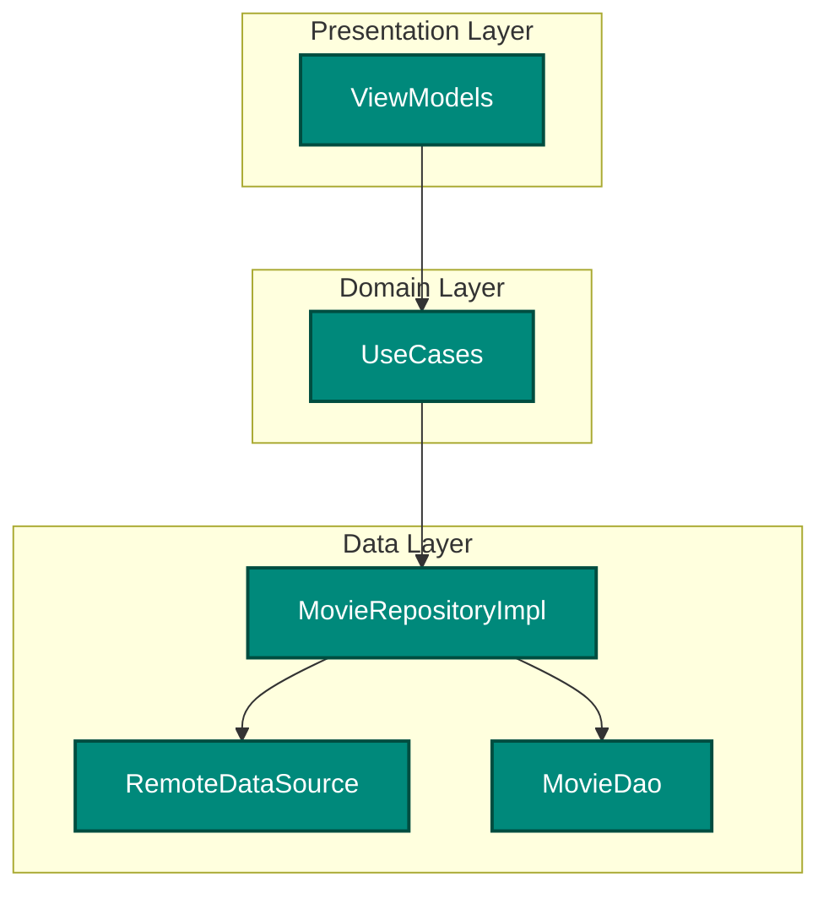
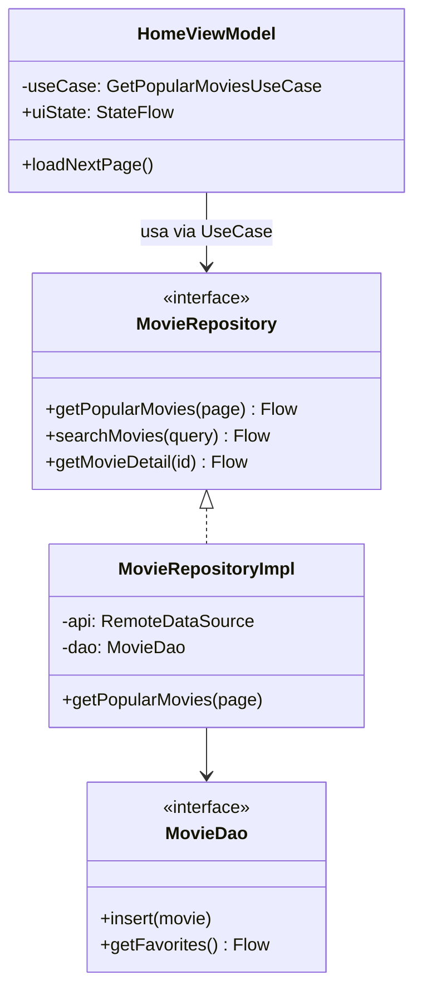

# MovieFlux Diagramas

## 1. Fluxo de Autenticação, Biometria e Navegação

Este diagrama detalha o processo de login mockado, a verificação de disponibilidade de biometria e a transição segura entre os grafos de navegação.

---

## 2. Estratégia Offline-First e Sincronização de Dados

Este diagrama ilustra como o `MovieRepositoryImpl` lida com o cache local (Room) e a API remota para garantir uma experiência fluida mesmo offline.

---

## 3. Fluxo de Interação: Home e Detalhes

Detalha a navegação entre a listagem e os detalhes, incluindo a busca com debounce e a ação de favoritar.

---

## 4. Gerenciamento de Estados da UI

Representação genérica de como os ViewModels (Home, Details, Favorites) expõem estados para as telas Compose.

---

## 5. C4 Model

Esta seção utiliza o modelo C4 para decompor a arquitetura do MovieFlux em diferentes níveis de abstração.

### Nível 1: Contexto (Context)
Descreve como o MovieFlux interage com usuários e sistemas externos.

### Nível 2: Containers
Detalha os componentes técnicos principais dentro do aplicativo Android.

### Nível 3: Componentes (Components)
Decompõe um container em seus componentes lógicos (focado na camada de dados e negócio).

### Nível 4: Código (Code)
Diagrama de classes simplificado mostrando as relações principais entre as classes centrais do sistema.

